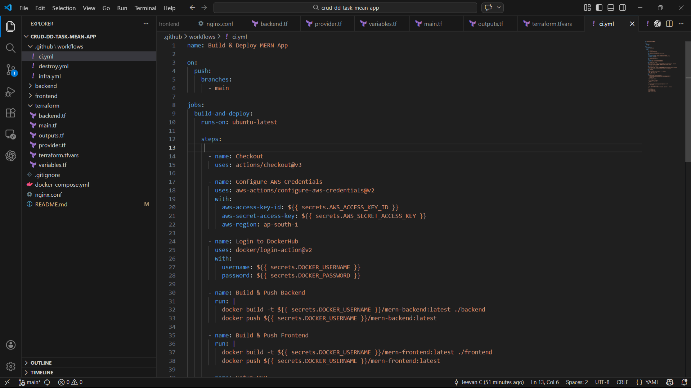
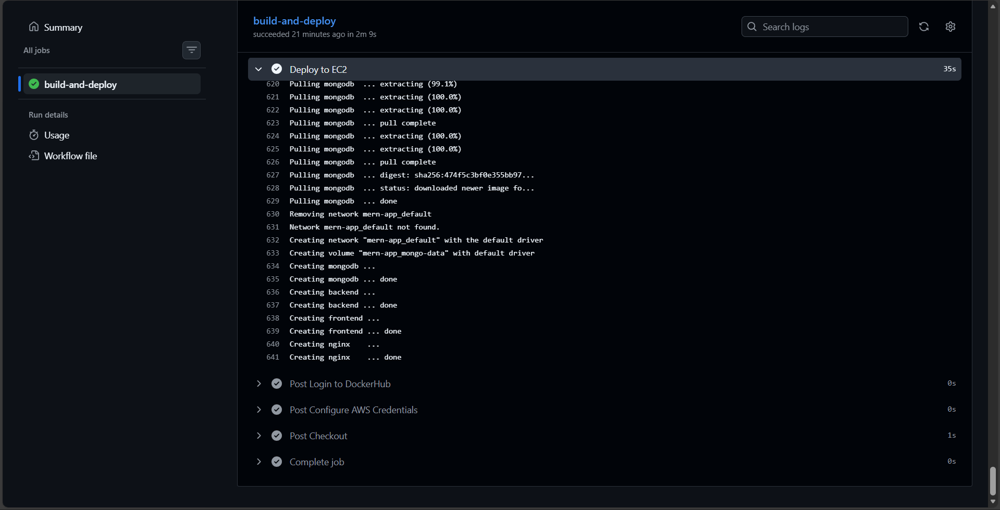
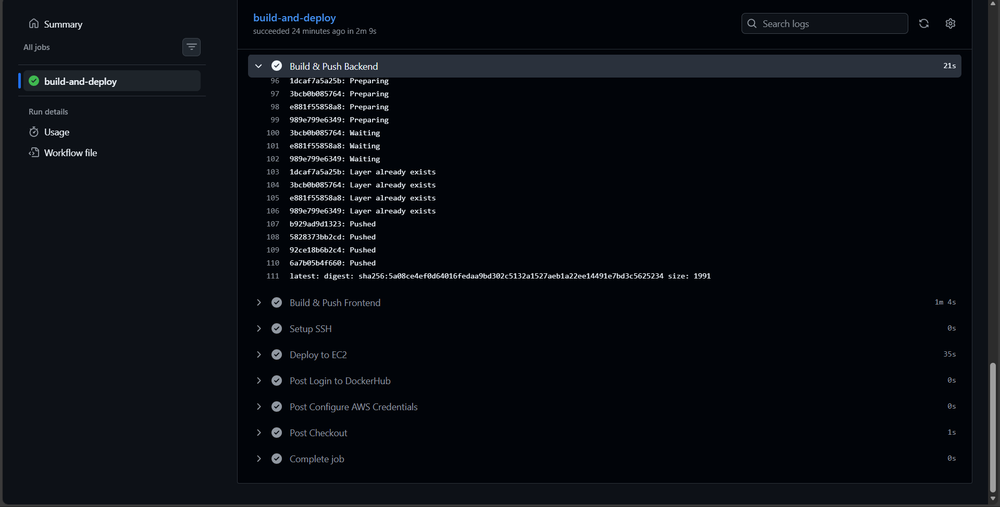
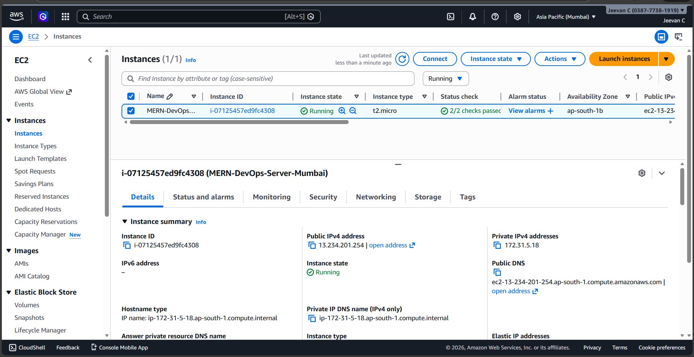
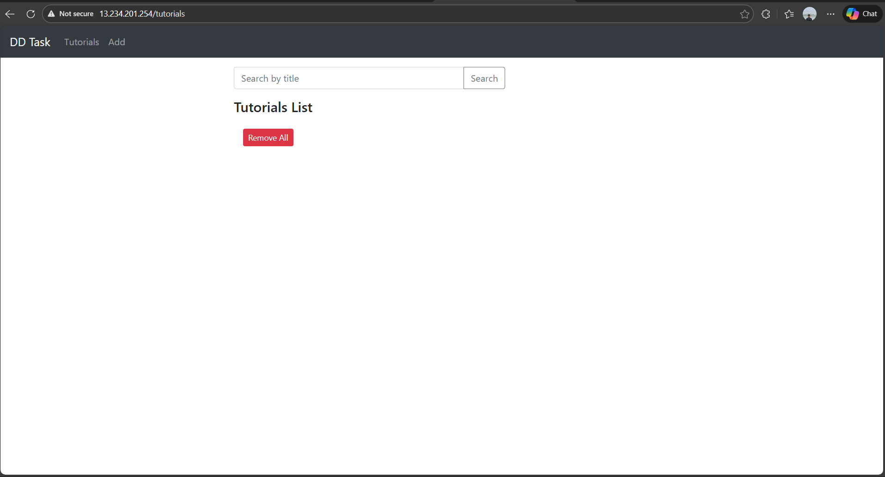

## MERN Stack Deployment using Docker, Terraform & GitHub Actions
 Project Overview:-

This project demonstrates a complete DevOps pipeline for deploying a containerized MERN (MongoDB, Express, Angular, Node.js) application to AWS using:

- Docker
- AWS EC2 (Mumbai – ap-south-1)
- Terraform (Infrastructure as Code)
- GitHub Actions (CI/CD)
- Nginx Reverse Proxy
- S3 Remote Backend for Terraform state

The deployment is fully automated — pushing code to GitHub triggers image build, push, and live deployment on EC2.

## Project Structure
```text
.
├── backend/
├── frontend/
├── terraform/
│   ├── main.tf
│   ├── backend.tf
│   └── variables.tf
├── docker-compose.yml
├── nginx.conf
└── .github/workflows/
    ├── infra.yml
    ├── ci.yml
    └── destroy.yml
```
## CI/CD Configuration

# 1️ Infrastructure Workflow (Terraform)

- Triggered on changes in terraform/
- Uses AWS credentials from GitHub Secrets
  Provisions:
   - EC2 (Ubuntu 22.04)
   - Security Group
   - Elastic IP
- Stores state remotely in S3

# 2️ Application Deployment Workflow

- Triggered on push to main branch.
Pipeline steps:
     - Checkout repository
     - Configure AWS credentials
     - Login to DockerHub
     - Build backend Docker image
     - Push backend image to DockerHub
     - Build frontend Docker image
     - Push frontend image to DockerHub
     - Dynamically fetch EC2 public IP
     - SSH into EC2
     - Pull latest images
     - Restart containers using Docker Compose
This ensures automated deployment on every push.

## Nginx Reverse Proxy Setup

The application is accessible via:
```bash
http://<EC2_PUBLIC_IP>
```
Nginx configuration:
```bash
events {}

http {
    server {
        listen 80;

        location / {
            proxy_pass http://frontend:80;
        }

        location /api/ {
            proxy_pass http://backend:5000/;
        }
    }
}
```
- / → Angular frontend
- /api → Backend API
- Entire app exposed via port 80

## Step-by-Step Setup & Deployment Instructions
# 1️ Clone Repository
```bash
git clone <repository-url>
cd Mern-deployment
```
# 2️ Configure GitHub Secrets

Add the following in GitHub → Settings → Secrets:
```bash
AWS_ACCESS_KEY_ID
AWS_SECRET_ACCESS_KEY
DOCKER_USERNAME
DOCKER_PASSWORD
EC2_SSH_KEY
KEY_NAME
```
# 3️ Provision Infrastructure

Push Terraform changes OR trigger infra workflow:
```bash
git push
```
Terraform will:

- Create EC2
- Allocate Elastic IP
- Store state in S3

# 4️ Deploy Application

Push to main branch:
```bash
git commit --allow-empty -m "Trigger deployment"
git push
```
CI/CD will:

- Build Docker images
- Push to DockerHub
- SSH into EC2
- Pull images
- Restart containers

# 5️ Access Application

Open:
```bash
http://<EC2_PUBLIC_IP>
```


## Screen Shots











